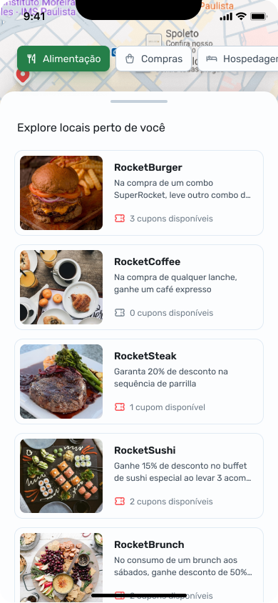

# Nearby - Clube de Benefícios


## 🌟 Sobre o Projeto

**Nearby** é um aplicativo mobile de clube de benefícios que oferece cupons para utilizar em estabelecimentos próximos a você. Desenvolvido com **React Native**, **Expo** e **TypeScript**, o app permite que os usuários encontrem ofertas exclusivas e aproveitem descontos especiais em diversas categorias.

## 📲 Telas do Aplicativo

 |  |  |  


## 🚀 Como Rodar o Projeto

1. Clone o repositório:
   ```sh
   git clone git@github.com:marlisonmourao/Nearby.git
   ```
2. Acesse a pasta do projeto:
   ```sh
   cd nearby
   ```
3. Instale as dependências:
   ```sh
   npm install
   # ou
   yarn install
   ```
4. Inicie o servidor Expo:
   ```sh
   npx expo start
   ```
5. Escaneie o QR Code com o Expo Go no seu celular ou use um emulador.

## 🛠️ Tecnologias Utilizadas

- **React Native** - Para o desenvolvimento do aplicativo mobile
- **Expo** - Para facilitação na execução e build do projeto
- **TypeScript** - Para tipagem segura e melhor manutenção do código
- **React Navigation** - Para gerenciar a navegação entre telas
- **Axios** - Para consumo de API
- **@gorhom/bottom-sheet** - Para o modal de login

## 👨‍💻 Autor

Desenvolvido por **Marlison Mourão**.

[](linkedin.com/in/marlison-mourão-8b1569218)

